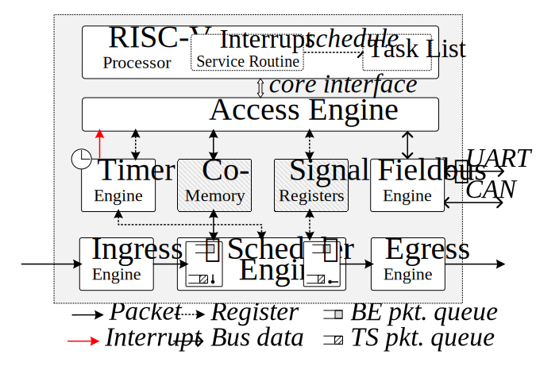

# DetChip
A Deterministic Embedded End-system Tightly Coupled with TSN Schedule

<div align="center"></div>

DetChip (Deterministic Chip) is a deterministic on-chip architecture for embedded end-systems in Time-Sensitive Networking (TSN)[1]. Based on DetChip, we formalize the execution ability of end-systems as end-system constraints (ECs) to co-schedule end-systems and the TSN network. This repository includes the Verilog code implementing DetChip, the software testing usecases, and ITP[2]-based ECs implementation. 


## Files in this Repository

#### Hardware/

Verilog source codes of Detchip.

#### Software/

Testing usecases.

#### End-system_Constraints/

Proposed constants.


## Citation
Please include this citation if you use this work as part of your project:

```
@inproceedings{DetChip,
	title={A Deterministic Embedded End-system Tightly Coupled with TSN Schedule},
	author={Chenglong Li, Zonghui Li, Tao Li, Cunlu Li, and Baosheng Wang},
	booktitle={},
	year={2022}
}
```

## References

[1] IEEE 802.1 TSN TG. Time-Sensitive Networking [URL](https://1.ieee802.org/tsn/).

[2] Jinli Yan, Wei Quan, Xuyan Jiang and Zhigang Sun, "Injection Time Planning: Making CQF Practical in Time-Sensitive Networking," IEEE INFOCOM 2020 - IEEE Conference on Computer Communications, 2020, pp. 616-625, doi: 10.1109/INFOCOM41043.2020.9155434.
