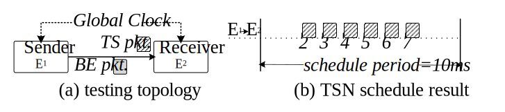

## Software Test Cases

This repository shows the C codes for a point-to-point test topology. Two DetChip prototypes (i.e. sender and receiver) are directly connected and given the same clock signal to ensure full clock synchronization, as shown below.

<div align="center"></div>


### Files Organization

  - `TaskExecution_Polling/`: Polling-based task model.
    - `Firmware(receiver)/`: test codes of the receiver.
      - `tuman_program.c`: main function.
    - `pkt_io/`: packet processing interface functions.
    - `ptp_riscv/`: clock synchronization interface functions.
    - `timer_mg/`: timer engine interface functions.
    - `common.h`: global type definition.

  - `TaskExecution_TTInterrupt/`: time-triggered interrupt (TTI)-based task model.
    - `Firmware(receiver)/`: test codes of the receiver.
      - `task.c`: time-triggered schedule initial.
      - `tuman_program.c`: main function.
    - `Firmware(sender)/`: test codes of the sender.
      - `task.c`: time-triggered schedule initial.
      - `tuman_program.c`: main function.
    - `pkt_io/`: packet processing interface functions.
    - `ptp_riscv/`: clock synchronization interface functions.
    - `timer_mg/`: timer engine interface functions.
    - `common.h`: global type definition.

### Environment Setup

We suggest following the steps given by PicoRV32 ([Building a pure RV32I Toolchain](https://github.com/YosysHQ/picorv32#building-a-pure-rv32i-toolchain)).

### Firmware Compilation

We set up a compile script `domk.sh` in each test folder (e.g. `Firmware(receiver)/`). 

Example:

```
  cd ./Firmware(receiver)/
  ./domk.sh
```

Five result files will be generated when the compilation is successfully done, which include `firmware.bin`, `firmware.dis`, `firmware.elf`, `firmware.hex` and `firmware.map`. The `firmware.dis` shows the assembly instructions for the test program. The `firmware.hex` contains the machine instructions for the test program, and each line represents a 32-bit hexadecimal instruction. The content of the `firmware.hex` needs to be stored into the instruction RAM of the RISC-V Processor.